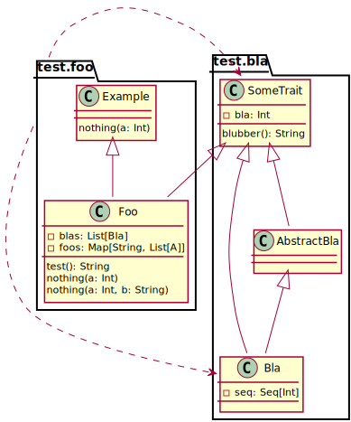

# scala-insights
Compiler plugin that extracts information from the underlying scala code base.

## Extracted information

### Package Dependencies

Shows which package depends on which other package in the project.

Example: if class `test.foo.Foo` uses type `test.bla.Bla`, then package `test.foo` depends on package `test.bla`.
The resulting package dependency diagram looks like this:


A Json is created, that has all package dependencies and can be used for post processing the data. See [Example](docs/examples/package_dependency.json)

### Package summary

For every package that is compiled in the current project, a package diagram is created.
It shows all classes of the package with information about properties and methods as well as all dependencies.


### Class summary
 
A class summary is created for all classes in the project, which can be overwhelming pretty fast in real world projects and are only here for completeness.
Proper filters should be applied to only see reasonable information.




A Json is created, that has all collected information and can be used for post processing the data.
See [Example](docs/examples/class_summary.json)

## Usage in sbt

Add the following line to your sbt build file: 
```scala
addCompilerPlugin("de.aquanauten" %% "scala-insights" % "0.1.0")
```

Plugin options have to be set via scalac options. See [Plugin Options](#options) for a list of all available options.

```scala
scalacOptions in Compile ++= Seq(
  "-P:insights:classExcludes:impl" 
)

```

Please note: This plugin hooks into the compiler and extracts information, the compiler sees. 
`sbt` uses incremental compilation. To get a complete view, the project has to be compiled completely.
 The easiest way to get a full build is `sbt clean compile`


## <a name="options"></a> Plugin Options

- basePackage (Default: None):  Used for computing package dependencies. Only classes inside basePackage are used to define dependencies. 
By default the basePackage is unset and uses the base package of the class that is currently compiled (`foo.bla.Test` --> basePackage is `foo`). 
This usually filters out all external dependencies. 
- targetDir (Default: target/insight): The directory where all the results are written.
- packageFile (Default: package_dependency): Name of the file for package dependency. Note: several formats are written with different file extensions.
- packageExcludes (Default: None): Exclusion rules for filtering out packages. Format is: `{regexp}:{regexp}:...:{regexp}` 
- classFile (Default: class_summary): Name of the class file summary. Note: several formats are written with different file extensions.
- classExcludes (Default: None): Exclusion rules for filtering out classes. Format is: `{regexp}:{regexp}:...:{regexp}`

Those options have to be defined as `scalac`-options. 